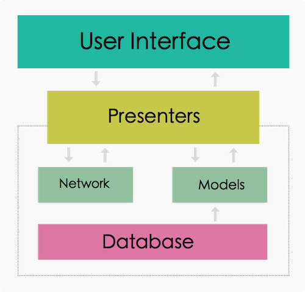
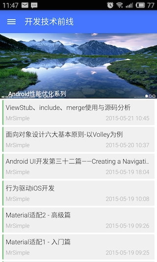
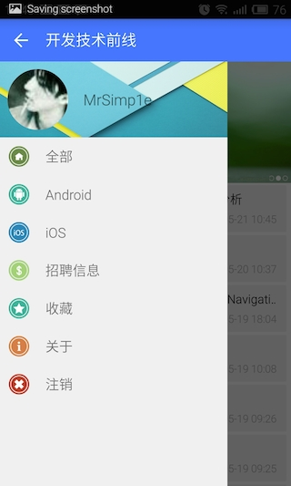
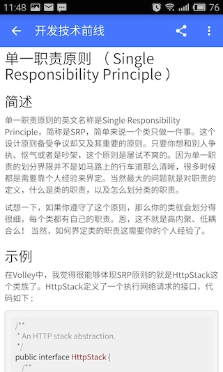

# 开发技术前线 Android 客户端需求文档
该项目是[开发技术前线](http://www.devtf.cn)的Android客户端，同时也是一个MVP应用架构的简单示例，我们会慢慢完善功能、添加测试用例，欢迎感兴趣的同学贡献代码。`切记注意代码规范和代码质量，并且遵循MVP架构模式（目前还未调整好）。`

## 功能需求

1. 用户进入App，首先获取前50篇文章记录，显示文章标题、作者、阅读量、创建时间；
2. 下拉到最底部时加载后50条数据；
3. 用户点击某篇文章后跳转到文章阅读页面，通过webview加载相关内容；
4. 文章内容缓存到本地数据库;
5. 用户可以通过左边的菜单切换文章分类，含有Android、iOS、招聘信息、关于等；
6. 用户可以通过第三方社交平台登录，可以分享文章到社交平台(微博、QQ、QQ空间、朋友圈、微信)；
7. 用户可以收藏文章，收藏需要用户登录，以用户id标识某篇文章已经被用户收藏。

**注意 : 项目引用了support v7库,该库没有包含在项目中，请自行引用。**    

## 整体架构

角色介绍 : 

* User Interface : 用户界面，通过接口抽象函数功能，解除Presenter与具体UI的耦合；
* Presenters : 业务逻辑层，作为UI与Model、网络操作的中间人，接触业务逻辑与UI的耦合；
* Network : 网络操作层，处理http请求;
* Models : 数据的增删改查操作，例如数据库操作；
* Database : 数据持久层，SQLite;

使用MVP架构模式，将业务逻辑与UI、数据操作隔离开来，保持灵活性，拥抱变化。

## 数据库设计

[数据库文档](document/db.md)

## 可能需要引用的库

* [picasso](https://github.com/square/picasso)
* [android-auto-scroll-view-pager](https://github.com/Trinea/android-auto-scroll-view-pager)

## 第三方SDK接入

* 新浪微博SDK;

## 界面版式图

|  |  |  |
|--------|--------|--------|
| 主界面 | 菜单界面 | 文章阅读界面 |
